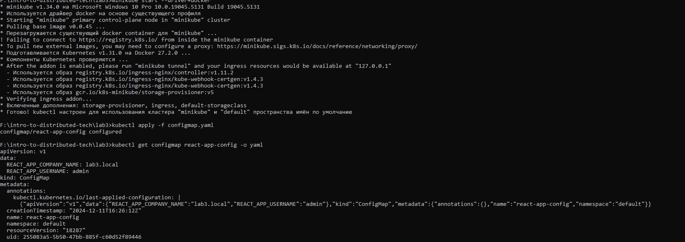
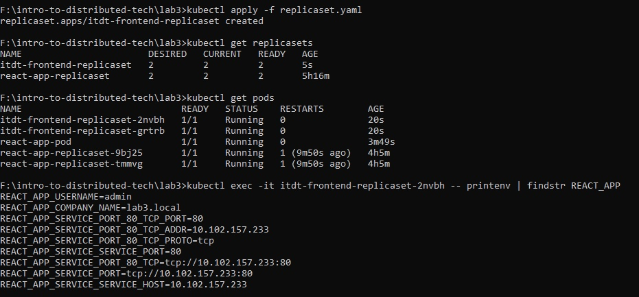
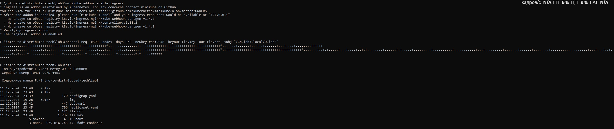
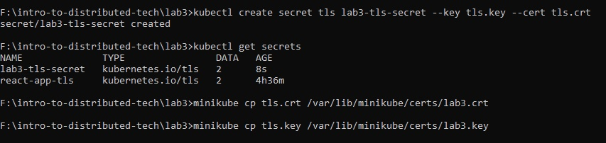
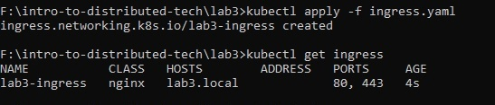
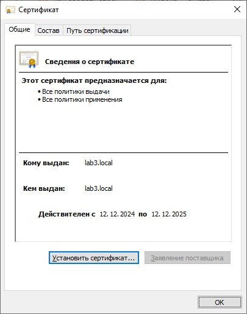
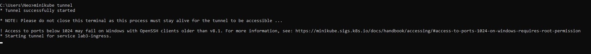

University: [ITMO University](https://itmo.ru/ru/)
Faculty: [FICT](https://fict.itmo.ru)
Course: [Introduction to distributed technologies](https://github.com/itmo-ict-faculty/introduction-to-distributed-technologies)
Year: 2023/2024
Group: K4110c
Author: Chizhov Nikita Alexandrovich
Lab: Lab3
Date of create: 11.12.2024
Date of finished: 12.12.2024  

1. Развернул minikube cluster при помощи docker ( minikube start --driver=docker )
2. Создал configmap.yaml
3. Применил configmap.yaml ( kubectl apply -f configmap.yaml )
4. Убедился что создано ( kubectl get configmap react-app-config -o yaml )
   
5. Создал манифест replicaset.yaml
6. Применил манифест ( kubectl apply -f replicaset.yaml )
7. Проверил что создано ( kubectl get replicasets )
8. Проверил что есть два пода с этим именем ( kubectl get pods )
9. Проверил переменные окружения в одном из этих подов ( kubectl exec -it itdt-frontend-replicaset-2nvbh -- printenv | findstr REACT_APP )  
     
10. Включил дополнение ingress ( minikube addons enable ingress )
11. Сгенирировал TLS сертификат ( openssl req -x509 -nodes -days 365 -newkey rsa:2048 -keyout tls.key -out tls.crt -subj "/CN=lab3.local/O=lab3" )
12. Проверил что файлы с .crt и .key созданы ( dir )  
      
13. Содал секрет из серитификата и ключа ( kubectl create secret tls lab3-tls-secret --key tls.key --cert tls.crt )
14. Проверил что секрет создан ( kubectl get secrets )
15. Импортировал сертификат в minikube ( minikube cp tls.crt /var/lib/minikube/certs/lab3.crt и minikube cp tls.key /var/lib/minikube/certs/lab3.key )  
      
16. Создал ingress.yaml
17. Применил ingress.yaml ( kubectl apply -f ingress.yaml )
18. Проверил что ingress успешно создан ( kubectl get ingress )  
      
19. Установил сертификат на Windows  
      
20. Запустил туннель minikube ( minikube tunnel )  
      
