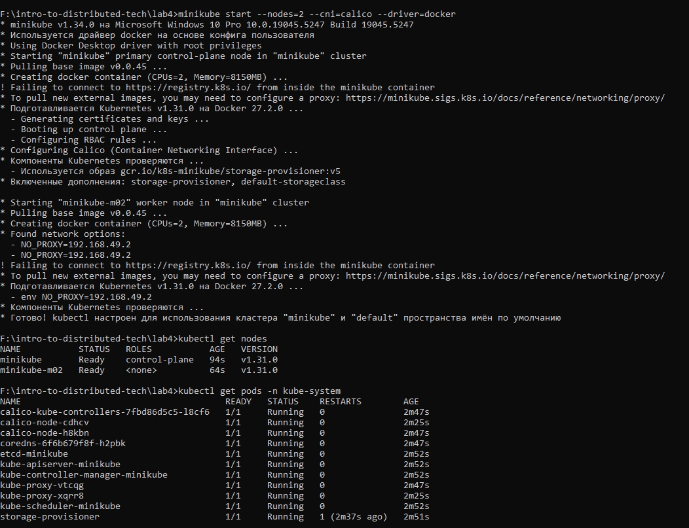
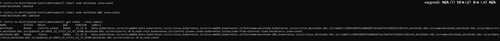
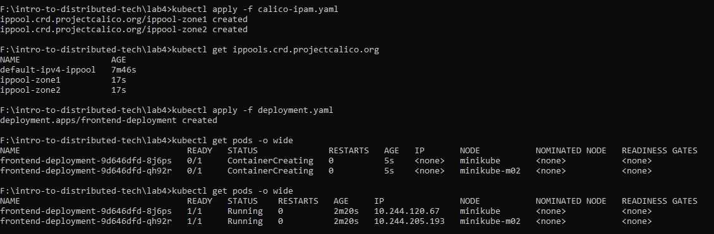
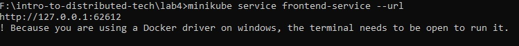
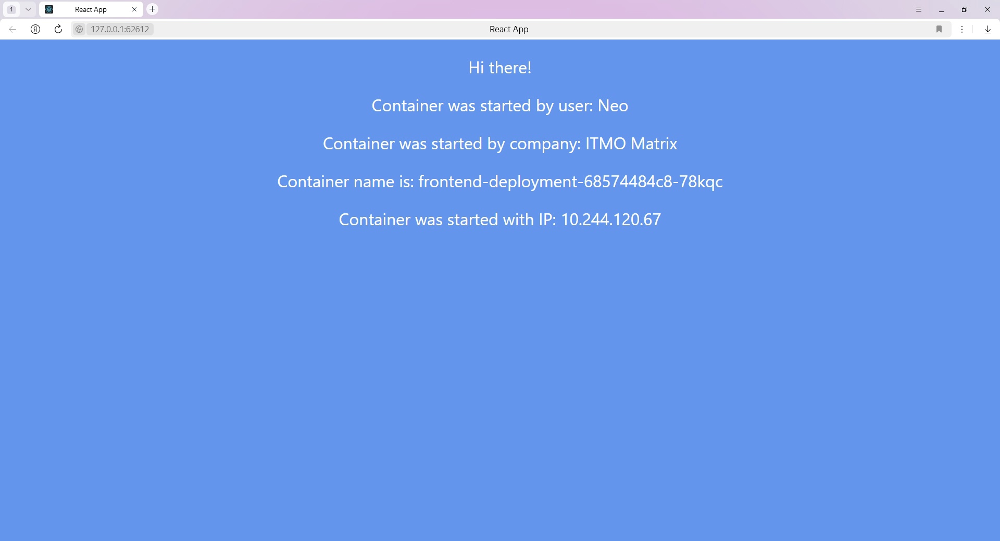
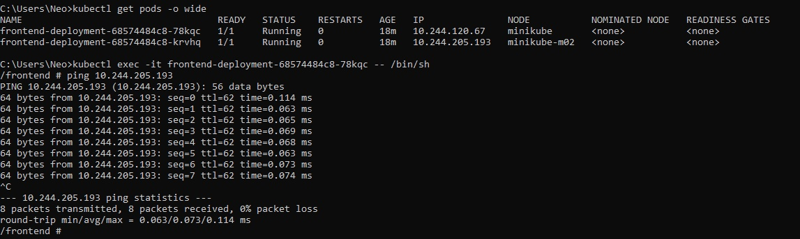

University: [ITMO University](https://itmo.ru/ru/)  
Faculty: [FICT](https://fict.itmo.ru)  
Course: [Introduction to distributed technologies](https://github.com/itmo-ict-faculty/introduction-to-distributed-technologies)  
Year: 2023/2024  
Group: K4110c  
Author: Chizhov Nikita Alexandrovich  
Lab: Lab4 
Date of create: 13.12.2024  
Date of finished: .12.2024   

1. Запустил Minikube с CNI плагином Calico, двумя нодами и докером как драйвером виртуализации ( minikube start --nodes=2 --cni=calico --driver=docker)
2. Проверил количество нод ( kubectl get nodes )
3. Проверил работу плагина Calico ( kubectl get pods -n kube-system )
   
4. Добавил метки локации zone1 и zone2 ( kubectl label nodes <node-name-1> location=zone1 и kubectl label nodes <node-name-2> location=zone2 )  
     
5. Создал и применил манифест calico-ipam.yaml ( kubectl apply -f calico-ipam.yaml )
6. Создал и применил манифест deployment.yaml ( kubectl apply -f deployment.yaml )
7. Проверил поды ( get pods -o wide )  
     
8. Пробросил порты и узнал url ( minikube service frontend-service --url )  
     
9. Просмотрел web со сменой контейнеров и ip  
     
     
10. Зашёл в первый под ( kubectl exec -it frontend-deployment-68574484c8-78kqc -- /bin/sh )
11. Выполнил пинг по адресу ( ping 10.244.205.193 )  
     
